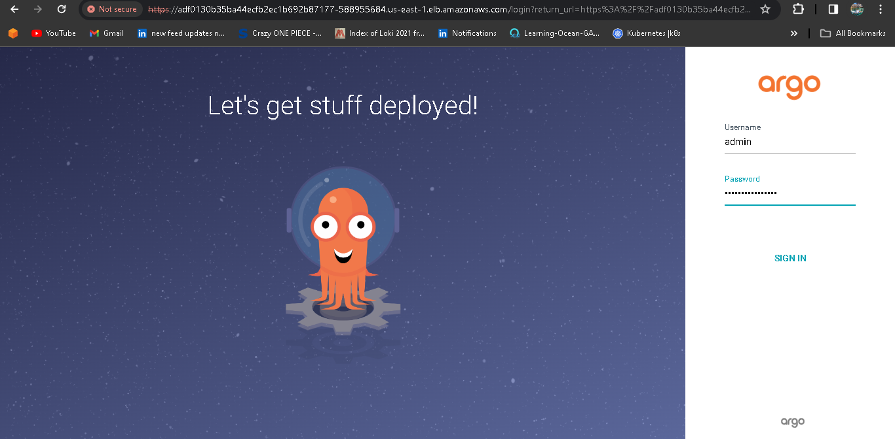

# DevSecOps Project : Swiggy-Clone

In today's fast-paced digital landscape, building and deploying applications not only requires speed but also airtight security. That's where DevSecOps comes into play, blending development, security, and operations into a single, unified process.

## Tools Used:

* AWS
* Jenkins
* Github
* SonarQube
* Trivy
* OWASP
* Docker & Dockerhub
* EKS Cluster
* ArgoCD

### DevSecOps Project Diagram:


### Step 1: IAM Configuration
- create IAM user `jenkins-user` with administration access.
- Generate Security Credentials: Access Key and Secret Access Key.

### Step 2: EC2 Setup
- Launch an Ubuntu instance in your favourite region (eg. region `us-east-1`).
- SSH into the instance from your local machine.

### Step 3: clone repo
```shell
git clone https://github.com/nusratdevo/swiggy-app.git
```

### Step 4: install tools
- make file executable and Run the file
``` shell 
chmod +x tools-install.sh
./tools-install.sh
```
### Step 5: check every tools install successfully
``` shell
jenkins --version
docker --version
docker ps
terraform --version
kubectl version
aws --version
trivy --version
```

### Step 6: Open jenkins in browser, login and install tools
``` shell
Open jenkins on port <EC2 Public_IP>:8080
administrative password : sudo cat /var/lib/jenkins/secrets/initialAdminPassword
```
- To install Plugin, go to Jenkins dashboard -> Manage Jenkins -> Manage Plugins -> Available tab.
```shell
Eclipse Temurin Installer
Docker Pipeline Step Docker
Docker-build-step
Docker
Config File Provider
SonarQube Scanner
Sonar Quality Gates
OWASP dependency check
NodeJs 
```
- Click on the "Install without restart" button.
- Goto Manage Jenkins → Tools → Install autometically → Click on Apply and Save
* we will install owasp, docker and sonar-scanner tools

### Step 7: Docker token generate and configure in jenkins
- Now go to the Dockerhub My Account--> Security --> New access token and copy the token.
- Goto Jenkins Dashboard → Manage Jenkins → Credentials → system → Global credentials (unrestricted)→ Add username with password.
- kind(username with password)->username(dockerhub username)->pass(dockerhub secrete)->Id(docker-cred)

### Step 8: Personal Access Token for Git(private) and configure in jenkins
- Navigate to your account -> settings ->Developer settings ->
Generate a new token, providing it with the necessary permissions (e.g., repo access).
- go to Jenkins Dashboard → Manage Jenkins → Credentials → Add Credentials → add kind as Secret Text
```shell
GITHUB_TOKEN_NAME in ID field
GITHUB_TOKEN in secret field
```
### Step 9: Sonar server configuration
- Sonarqube works on Port 9000, so <Public_IP>:9000. username: admin, password: admin
- Create SonarQube token : Click on Administration → Security → Users → Click on Tokens and Update Token → Give it a name → and click on Generate Token
- In the Sonarqube Dashboard, add a quality gate as well: Click on the quality gate → create →give it a name -> click save
- In the Sonarqube Dashboard, Create Webhook option as shown in below: Administration--> Configuration-->Webhooks, URL Section: <http://jenkins-public-ip:8080>/sonarqube-webhook/> ->Create

### Step 10: Sonar server configuration in jenkins
- Configure SonarQube Credentials:
* Goto Jenkins Dashboard → Manage Jenkins → Credentials → Add secret text.
* kind (secret text) -> secret (sonar_token) -> ID (sonar-token) ->create

- Configure Sonar Server: Configure System option is used in Jenkins to configure different server
* Goto Dashboard → Manage Jenkins → Configure System -> Click on Apply and Save
* SonarQube Installation -> name(sonar-server)->url(ip:9000)->token(sonar auth token save i jenkis)

### step 11: Setup new pipeline with name "swiggy-app

* Goto Dashboard → pipline-> pipeline name ->ok
* git setup ->repo -> branch ->cred(none)
* 

### Step 12: setup eks cluster
- Installation of KUBECTL, EKSCTL, AWS CLI are done previousely 
- configure aws cli credentials for eks creation in us-east-1 region.
```shell 
aws configure
```
- Create EKS Cluster using eksctl command:
```shell
eksctl create cluster --name <name-of-cluster> --region <regionName> --node-type <instance-type> --nodes-min <min-no-of-nodes> --nodes-max <max-no-of-nodes>

eksctl create cluster --name swiggy-cluster --region us-east-1 --node-type t2.medium --nodes-min 2 --nodes-max 4
```
* It will take 10–15 minutes to create a cluster.
- EKS Cluster is up and ready and check with the below command
```shell
kubectl get no
kubectl get po
```
### Step 13: Installing ArgoCD
- Now let's install ArgoCD in the EKS Cluster.
```shell
kubectl create ns argocd
# This will create a new namespace, argocd, where Argo CD services and application resources will live.
kubectl create namespace argocd
kubectl apply -n argocd -f https://raw.githubusercontent.com/argoproj/argo-cd/v2.4.7/manifests/install.yaml
```
- Download Argo CD CLI:
```shell
curl -sSL -o argocd-linux-amd64 https://github.com/argoproj/argo-cd/releases/latest/download/argocd-linux-amd64
sudo install -m 555 argocd-linux-amd64 /usr/local/bin/argocd
```
- Access The Argo CD API Server with Service Type Load Balancer:
```shell
# Change the argocd-server service type to LoadBalancer.
kubectl patch svc argocd-server -n argocd -p '{"spec": {"type": "LoadBalancer"}}'
```
* Wait about 2 minutes for the LoadBalancer creation
```shell 
export ARGOCD_SERVER=kubectl get svc argocd-server -n argocd -o json | jq --raw-output '.status.loadBalancer.ingress[0].hostname'
```
-The initial password is autogenerated with the pod name of the ArgoCD API server.
```shell 
export ARGO_PWD=`kubectl -n argocd get secret argocd-initial-admin-secret -o jsonpath="{.data.password}" | base64 -d`
```
- NOW get the loadbalancer url and argocd password.
```shell 
echo $ARGOCD_SERVER
echo $ARGO_PWD
```
- List the resources in the namespace:
```shell
kubectl get all -n argocd
kubectl get svc -n argocd
```
- Lets create new namespace for application.
```shell
kubectl create ns swiggy
```
Pickup the URL and paste it into the web to get the UI as shown below image:


- goto settings ->repository(git repo)
- configure the details in Application.application name(swiggy-app)->repository url(github project url)->path(manifest file path)->cluster url->namespace
- the pods running in the EKS Cluster
```shell
kubectl get po -n swiggy
kubectl get all -n swiggy
```
 ### Step 14: Clean up your resources:
 - Delete Cluster
 ```shell
 eksctl delete cluster --name swiggy-cluster
```